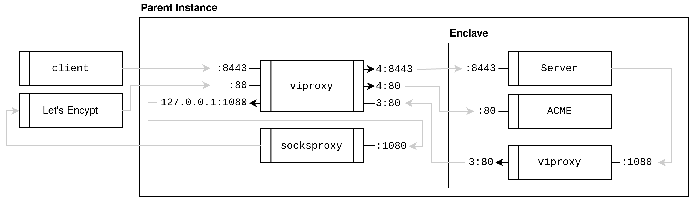

# Nitriding

[](https://pkg.go.dev/github.com/blocky/nitriding)

This package helps with building Go-based Web applications on top of AWS Nitro
Enclaves. The package provides the following features:

1. Automatically obtains an HTTPS certificate (either self-signed or via [Let's
   Encrypt](https://letsencrypt.org)) for clients to securely connect to your
   enclave over the Internet.

2. Automatically exposes an HTTPS endpoint for remote attestation. After
   having audited your enclave's source code, your users can conveniently
   verify the enclave by using a tool like
   [verify-enclave](https://github.com/brave-experiments/verify-enclave)
   and running:

   ```
   make verify CODE=/path/to/code/ ENCLAVE=https://example.com/attest
   ```

3. Provides an API for the enclave application to securely share confidential
   key material with an identical, remote enclave.

4. Starts a proxy component that transparently translates between IP and VSOCK,
   so you can write IP-based networking code without having to worry about
   the enclave's constrained VSOCK interface.

5. Automatically initializes the enclave's entropy pool using the Nitro
   hypervisor.

To learn more about nitriding's trust assumptions, architecture, and build
system, take a look at our [research paper](https://arxiv.org/abs/2206.04123).

## Example

For an example on how to create and check attestations see
`examples/main_test.go`. The test runs `examples/main.go` to create a server
based on a  `StandaloneAttester` that makes attestations on you local
machine based on a self-signed certificate. `example/main.go` also contains
instructions on how to configure a server based on a `NitroAttester` to
create attestations using the Nitro Secure Module (NSM) on a Nitro Enclave.
Note that to run on an enclave, its parent instance needs to run a
[viproxy](https://github.com/brave/viproxy)
and a
[socksproxy](https://github.com/brave-intl/bat-go/tree/nitro-utils/nitro-shim/tools/socksproxy)
to connect the components of the system as in the following diagram.



The `Server` process running insider the Enclave handles user requests on
port `8443`.
Since the enclave has no ports open to outside clients, `viproxy` running on the
Parent Instance forwards packets between IP port `8443` and the `vsock`
address `4:8443`, where `4` is the `EnclaveID` for the Enclave.
In this manner `client` requests to the address `FQDN:8443` may reach
the `Server`.

To handle `HTTPS` the `Server` obtains a certificate
from [Let's Encrypt](https://letsencrypt.org/).
The `Server` starts
an `ACME` [autocert manager](https://golang.org/x/crypto/acme/autocert) to 
accept
challenges on port `80`.
Again the `viproxy` exposes the IP port `80` externally and forwards packets to
the `vsock` address `4:80`.
To send requests to Let's Encrypt the server communicates through a SOCKS proxy
service `socksproxy` running on the Parent Instance on port `1080`.
To reach `socksproxy` the `Server` issues a request to port `1080` exposed by
a `viproxy` running inside the Enclave.
The Enclave `viproxy` forwards these requests to the address `3:80`, where `3`
is the `EnclaveID` of the Parent Instance.
In turn, the Parent Instance `viproxy` forwards packets from the `vsock`
address `3:80` to the IP address `127.0.0.1:1080` and so to the `socksproxy`
process.